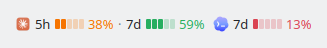
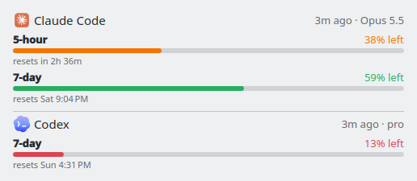
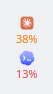

# AI Usage Limit for KDE Plasma

Claude Code and Codex rate-limit usage, in your Plasma panel. This is the KDE
port of [ai-usage-limit](https://github.com/lexbryan/ai-usage-limit), which does
the same for the GNOME top bar.



Everything on screen reports capacity **remaining**, not consumed: the bars
empty out as you spend and go green → yellow → red as they do, in your colour
scheme's own positive, neutral and negative colours. Click it for bars and
reset times:



On a vertical panel it shrinks to each provider's scarcest window:



## Install

### From the KDE Store

Right-click the panel → **Add or Manage Widgets…** → **Get New Widgets** →
**Download New Plasma Widgets**, search for *AI Usage Limit* and install it.
Then drag it from the widget list onto your panel.

Open it once and press **Connect Claude Code** (see below). Codex needs nothing.

### From a release file

Download the `.plasmoid` from [Releases](https://github.com/lexbryan/ai-usage-limit-kde/releases), then either
**Get New Widgets → Install Widget From Local File…**, or:

```sh
kpackagetool6 --type Plasma/Applet --install ai-usage-limit-1.0.0.plasmoid
kpackagetool6 --type Plasma/Applet --upgrade ai-usage-limit-1.0.1.plasmoid   # later
```

### From source

```sh
git clone https://github.com/lexbryan/ai-usage-limit-kde
cd ai-usage-limit-kde
./install.sh              # installs the widget and connects Claude Code
./install.sh --dry-run    # say what would change, change nothing
./install.sh --link       # symlink the widget to this checkout, for development
```

A widget that's already on a panel keeps running its old code until Plasma
restarts: `systemctl --user restart plasma-plasmashell`.

## Connecting Claude Code

Claude Code publishes your rate limits to exactly one place: the JSON it pipes
into your `statusLine` command. No file on disk holds them and no CLI command
prints them. So something has to sit in that position and write them down:

```
claude ──stdin JSON──▶ aiul-statusline.sh ──writes──▶ ~/.claude/cache/rate-limits.json ──▶ widget
```

**Connect** (in the popup, in the right-click menu, or run by `install.sh`) wraps
whatever statusline you already had rather than editing it:

```
statusLine.command = bash ~/.local/share/ai-usage-limit/aiul-statusline.sh <your original command...>
```

Your statusline gets the same bytes on stdin and its output passes straight
through, so what it shows doesn't change. Every failure path in the wrapper
falls through to running your command anyway. `settings.json` is backed up
before it is touched, and connecting twice changes nothing.

The wrapper is copied out of the widget into `~/.local/share/ai-usage-limit/`
first, because the widget's own directory is replaced on every store update and
deleted when you remove it. Your statusline must never point at a file that
has gone away.

**Disconnect** in the right-click menu puts your original command back exactly
as it was.

Codex already writes its limits into its session rollouts
(`~/.codex/sessions/`), so there is nothing to connect. The widget reads the
tail of the newest one every 30 seconds.

### Staleness

A reading is only as fresh as the last time you ran that tool:

| age | what happens |
|---|---|
| under 15 min | shown normally, coloured |
| 15 min – 24 h | shown faded; the popup gives the age |
| over 24 h | dropped from the panel, kept in the popup with its age |

The panel reads `⚡ –` until a Claude Code session draws its statusline once.
That is the first moment the numbers exist anywhere, so it is expected on a
fresh install.

## Requirements

- KDE Plasma 6.0+. Verified on 6.7.5 (Fedora 44, Wayland).
- `python3`, which is in the base system on every mainstream distro.
- `jq` is optional. The publisher uses it when present and falls back to python3.

## Uninstall

Right-click the widget → **Disconnect Claude Code**, then remove the widget from
the panel and uninstall it from **Add or Manage Widgets**. From a checkout,
`./uninstall.sh` does all of it. The cache at `~/.claude/cache/rate-limits.json`
is left behind; delete it if you like.

## Tests

```sh
./test/all.sh             # no Plasma needed; this is what CI runs
tools/screenshots.sh      # needs Plasma 6: renders the widget, fails on any QML warning
```

| suite | covers |
|---|---|
| `logic.test.mjs` | formatting, bar rounding, used→remaining, staleness, malformed input from either provider, and a guard against JavaScript that node runs but Plasma's QML engine rejects |
| `test-wrapper.sh` | the publisher: stdin forwarding, stdout and exit-status passthrough, the python3 fallback |
| `test-configure.sh` | every statusLine case, idempotence, backups, refusing to mangle invalid JSON |
| `test-codex.sh` | the Codex reader: window labels, newest reading across days, reading only the tail |
| `test-connect.sh` | Connect, state and Disconnect in a throwaway HOME, including a real statusline render through the connected command |
| `test-package.sh` | metadata, every file the QML uses, the built `.plasmoid`, and an install/uninstall round trip where `kpackagetool6` exists |

`logic.test.mjs` imports the same `logic.mjs` file the widget imports, so the
tests can't drift from what ships.

`tools/screenshots.sh` runs the real widget inside a nested, virtual KWin on a
private D-Bus with a throwaway HOME, so your session is never touched. It writes
the images in `docs/`, which are also the store listing's screenshots.

## Releasing

1. Bump `KPlugin.Version` in `package/metadata.json`.
2. If the UI changed, run `tools/screenshots.sh` and commit `docs/`.
3. Tag and push: `git tag v1.0.1 && git push origin v1.0.1`. CI runs every
   suite, refuses a tag that doesn't match `metadata.json`, builds
   `ai-usage-limit-1.0.1.plasmoid` and attaches it to a GitHub release.
4. Upload that same file to the widget's page on
   [store.kde.org](https://store.kde.org). Plasma's *Get New Widgets* browses
   the store's Plasma 6 widgets category. Users with the widget installed are
   offered the update there and in Discover.

`tools/build.sh` builds the same file locally into `dist/`.

## Shared with the GNOME version

These are vendored unchanged from
[lexbryan/ai-usage-limit@7e9f70d](https://github.com/lexbryan/ai-usage-limit/tree/7e9f70d0e34324a8a66c7b35b24717e0727ee526),
along with their test suites and the two icons:

- `package/contents/code/aiul-statusline.sh`
- `package/contents/code/aiul-codex-read.py`
- `package/contents/code/configure-statusline.py`

Both versions install the publisher to the same path and write the same cache,
so they can coexist and either one's Connect satisfies the other.

## Layout

| path | what it is |
|---|---|
| `package/` | the widget, exactly what the `.plasmoid` contains |
| `package/contents/ui/main.qml` | data and state: runs the readers, holds the readings |
| `package/contents/ui/CompactRepresentation.qml` | the panel, horizontal or vertical |
| `package/contents/ui/FullRepresentation.qml` | the popup, including the Connect prompt |
| `package/contents/code/logic.mjs` | parsing, staleness and formatting; no Qt, shared with the tests |
| `package/contents/code/connect.sh` | copies the publisher out and wraps statusLine |
| `package/contents/code/claude-state.py` | is statusLine wired, unwired, or is Claude Code absent |
| `package/contents/code/unwrap-statusline.py` | Disconnect |
| `install.sh`, `uninstall.sh` | the from-source route |
| `tools/build.sh` | builds `dist/ai-usage-limit-<version>.plasmoid` |
| `tools/screenshots.sh` | headless render: store screenshots and the QML smoke test |

## Logos

The Claude and Codex marks in `package/contents/images/` are third-party marks,
used to identify which provider a reading belongs to. They are not covered by
this project's licence.
